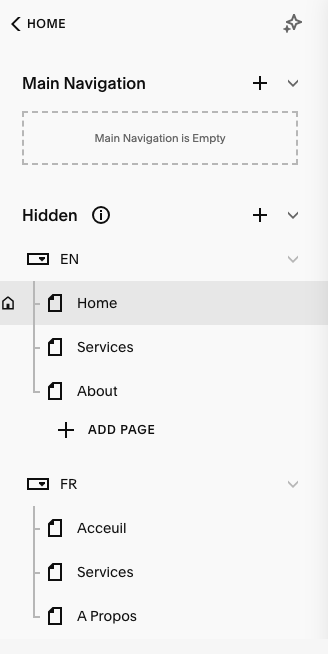
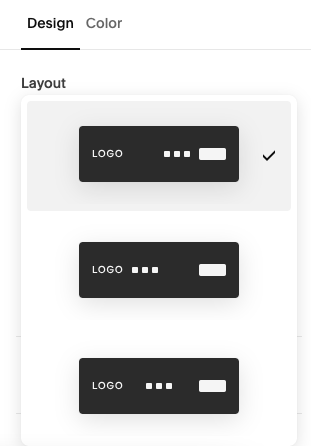
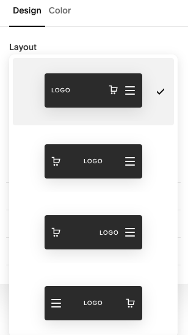

# Prepare the website

## Slug Strategies

The links and link structure is very important for user experience and search engines.
We need to ensure the search engines understand for which language each page is showing.
And we need to let visitors navigate through one language only, until they actively switch.
The challenge is also about what to do about the homepage i.e. the empty slug

 i.e. what do we show the users when they land on your website www.example.com

To satisfy this constraint. There are two strategies to organize links

### Default Language

The website would be organized as such:

#### Default language pages (example here for english):
> www.example.com/  
> www.example.com/services  
> www.example.com/about  
  
#### Other language pages (example here for french)  
> www.example.com/fr/  
> www.example.com/fr/services  
> www.example.com/fr/a-propos  

**Benefit**: 
- no need for a special landing page

**Drawback**:  
- more likely to have visitors landing on the homepage which could be the wrong language for them
- not all languages are equal

### No Default Language

The website would be organized as such:

#### Landing page:
> www.example.com/  

*This landing page would be language agnostic and provide the option for the user to choose a language*

#### Default language pages (example here for english):
> www.example.com/en/  
> www.example.com/en/services  
> www.example.com/en/about  

#### Other language pages (example here for french)
> www.example.com/fr/  
> www.example.com/fr/services  
> www.example.com/fr/a-propos  

For more information check [FAQ](/en/faq#faq-language-url-strategy)

## Remove linked pages

Because the navigation will be handled by the tool. You should remove the linked page navigation. 

Also I would recommend to nicely organize the pages into folder.

It should look like that

## Edit menu leyout

The tool should adapt to all the menu alternatives proposed by Squarespace.
The language switcher will be placed where the action buttons are

- Edit any page. 
- Hover the navigation
- Click Edit Site Header
- Layout

Then choose a layout. Do this for both a desktop and mobile.

>The desktop menu layout options:  
>
>  

>The mobile menu layout options:  
>
>  

---
If it does not work, please [contact us](../contact) with a link to a site or explain the issue. We will fix it.

