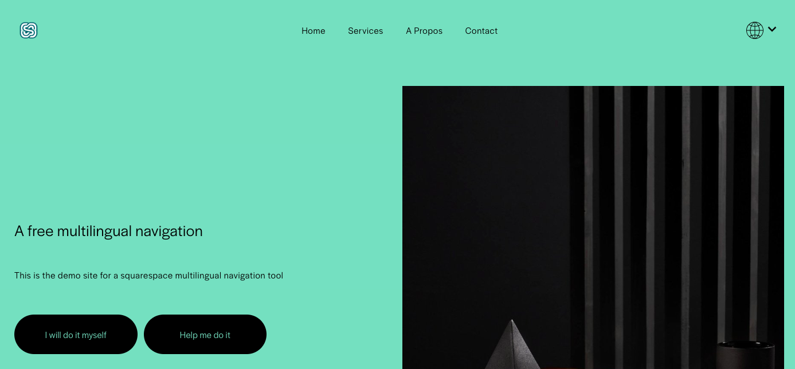
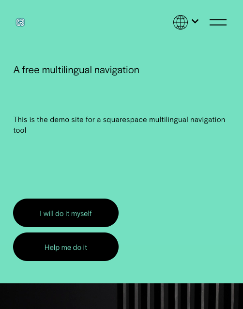
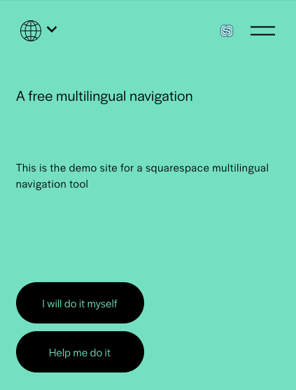
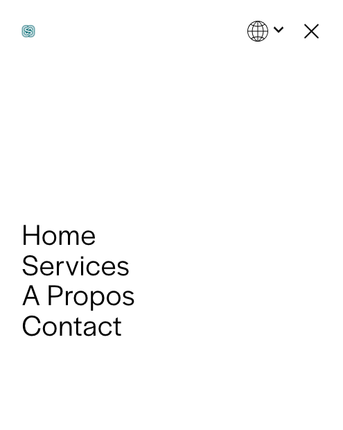
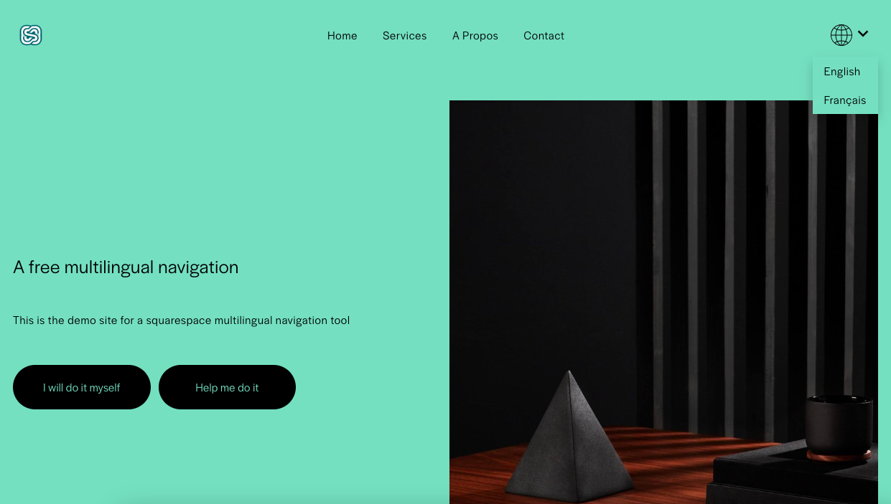
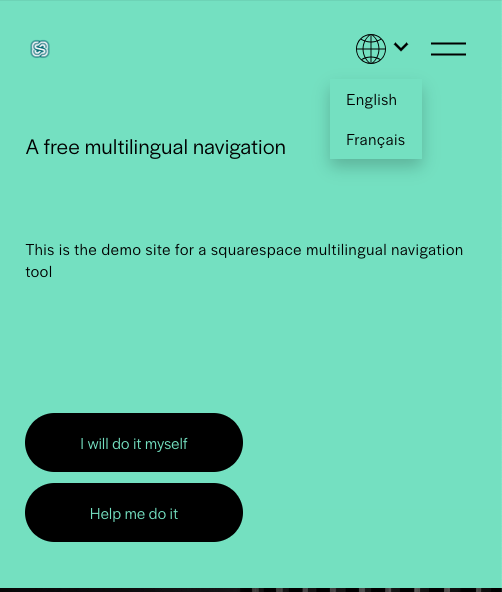

# Check the Squarespace multilingual site

A check on all pages is in order

## Check the navigation

- Check the header links
- Check the logo link

Here are some indicative screenshots:

 

 

## Check the language selector

Check that the language selector appears and shows **all** languages

## In case of issues

- Ensure that the page has the alternate language links
- Ensure that the code is correctly inserted. Pay attention to commas, apostrophes.

- Check the [FAQ](../faq.md)
- [Contact me](../contact.md)

