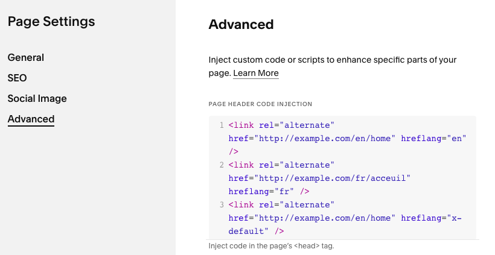

# Adding Language Alternates

## What are language alternates

These are simply tags on the webpage which are used to tell search engine crawlers which pages are translations of each other  

This is what it would look like for the homepage:

```html
<link rel="alternate" href="http://example.com/en/home" hreflang="en" />
<link rel="alternate" href="http://example.com/fr/acceuil" hreflang="fr" />
<link rel="alternate" href="http://example.com/en/home" hreflang="x-default" />
```

The `link` element with `rel="alternate"` is used to define alternate versions of a page for different languages or regions. Here's a breakdown of the attributes used in each tag:

1. `href`: Specifies the URL of the alternate version of the page.
2. `hreflang`: Indicates the language (and optional region) of the alternate URL.
3. `x-default`: Used in `hreflang` to specify a default URL when no other URL is a better match.


You need to put these same tags on all the pages inter-related by translations


## How to add language alternates on squarespace

The language alternates need to be updated for **every page** using the page settings.

This is what it looks like on Squarespace:  

  


## This is needed for all pages

All pages need to have this.

It is a tedious exercise but necessary for proper indexing of your pages by the search engine. 

Even if you do end up not using the multilingual tool presented here, you should do this anyway.

The tool will highlight to you  missing hreflang by missing navigation (means the current page is not referenced) or if there is a missing language in the switcher (means the alternate language is not provided).


## How the order matters

The order of the tags will define the order of the languages in the language switcher


