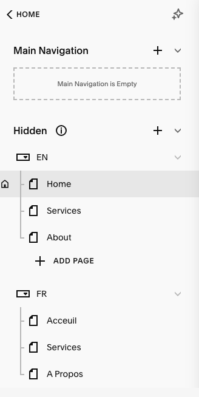
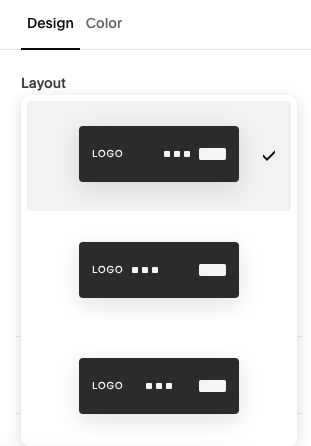

# Prepare the website

## Slug Strategies

There is one important decision to make before doing anything: **define language link structures**. 

The links and link structure is very important for both **user experience** and **search engines**. 

We need to ensure the search engines understand for which language each page is showing and how explain the relationship of pages from different languages. 

And we need to let visitors navigate through one language only, until they actively switch.  

All that said, one peculiar challenge is about **what should be the the homepage** i.e. the page one finds going to www.example.com without any  further slash. In squarespace it boild down to deciding one of two options:
1. serve the homepage of a language *(default language strategy)*  
or 
2. serve a landing page offering the visitor language choices

### Default Language Strategy

This strategy caters well to a website with a predominant language or if the expected audience of the site is large majority of one language.  

The website would be organized as such:

#### Default language pages (would serve english pages for instance):
> www.example.com/  
> www.example.com/services  
> www.example.com/about  
  
#### Other language pages (example here for french)  
> www.example.com/fr/  
> www.example.com/fr/services  
> www.example.com/fr/a-propos  

**Benefit**: 
- no need for a special landing page

**Drawback**:  
- more likely to have visitors landing on the homepage which could be the wrong language for them
- not all languages are equal

  
    

### No Default Language Strategy

This strategy is suited for a truly language-agnostic website.  

The website would be organized as such:

#### Landing page:
> www.example.com/  

*This landing page would be language agnostic and provide the option for the user to choose a language*

#### Any language page would be structured similarly

##### Example here for English:
> www.example.com/en/  
> www.example.com/en/services  
> www.example.com/en/about  

##### Example here for French:
> www.example.com/fr/  
> www.example.com/fr/services  
> www.example.com/fr/a-propos  

**Benefit**: 
- consistent language agnostic website
- less likely for user to land on a wrong language

**Drawback**:  
- Needs a special landing page

  
   

For more information check [FAQ](/en/faq#faq-language-url-strategy)

## Slug Implementation

Once you have decided on a strategy. Implement this strategy across your website by update the slugs:  
`/<language>/slug`

Notes:  
- It is good for SEO that each page has their tranlsated slug. e.g. 
  > /en/about  
  > /fr/a-propos  
  > /es/acerca-de  
- You can choose to use regional language variations or first-level languages, or mixing both for instance:
  > /en-US/  
  > /en-GB  
  > /fr/  
  > /es/  
  > /zh-CN/  
  > /zh-TW/  

## Remove linked pages

Because the navigation will be handled by the tool. You should remove the linked page navigation. 

Also I would recommend to nicely organize the pages into folder.

It should look like that

## Edit menu leyout

The tool should adapt to all the menu alternatives proposed by Squarespace.
The language switcher will be placed where the action buttons are

- Edit any page. 
- Hover the navigation
- Click Edit Site Header
- Layout

Then choose a layout. Do this for both a desktop and mobile.

>The desktop menu layout options:  
>
>  

>The mobile menu layout options:  
>
>  

---
If it does not work, please [contact us](../contact) with a link to a site or explain the issue. We will fix it.

