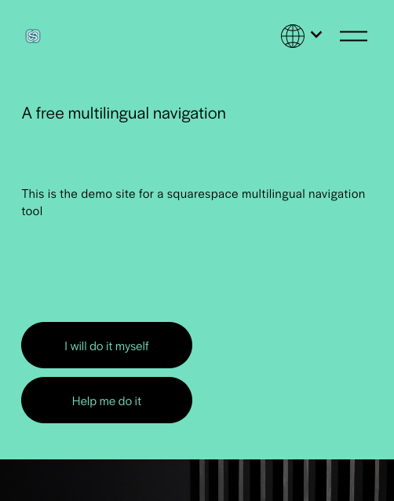
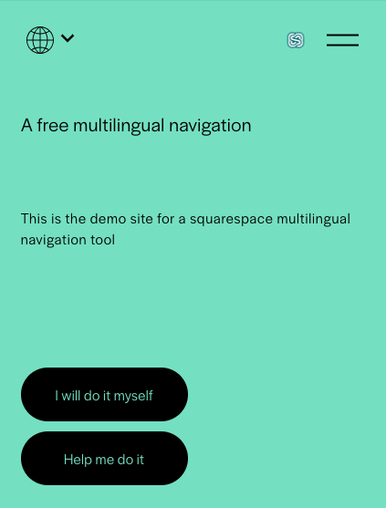
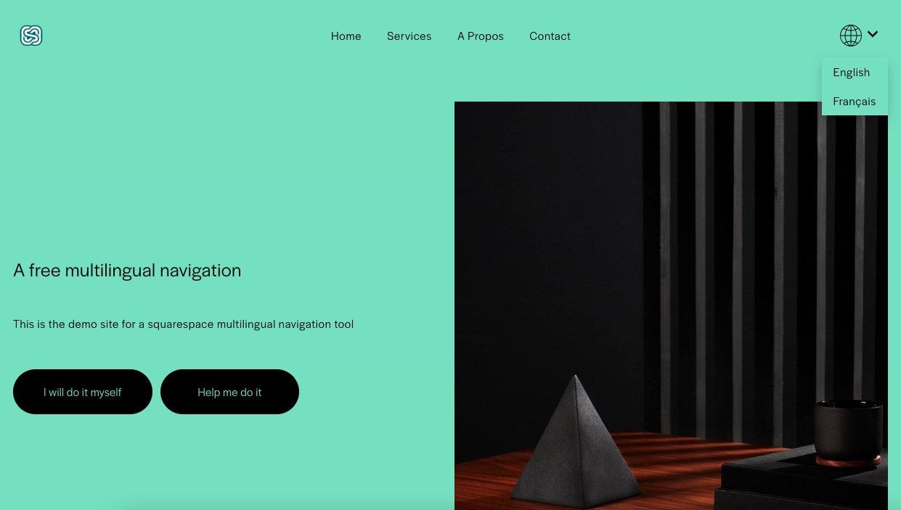

# Vérifier le site Squarespace multilingue

Une vérification sur toutes les pages est de mise

## Vérifier la navigation

- Vérifier les liens de l'en-tête
- Vérifier le lien du logo

Voici quelques screenshots indicatifs:

 

 

## Vérifier le selecteur de langue

Vérifier que le selecteur de langue apparait et montre **toutes** les langues

## En case de problèmes

- Assurez-vous que la page possède les liens alternatifs de langue
- Assurez-vous que le code est bien inséreé. Notez les virgules, les apostrophes.
- Regarder les [questions fréquentes](../faq.md)
- [Prenez contact](../contact.md)

